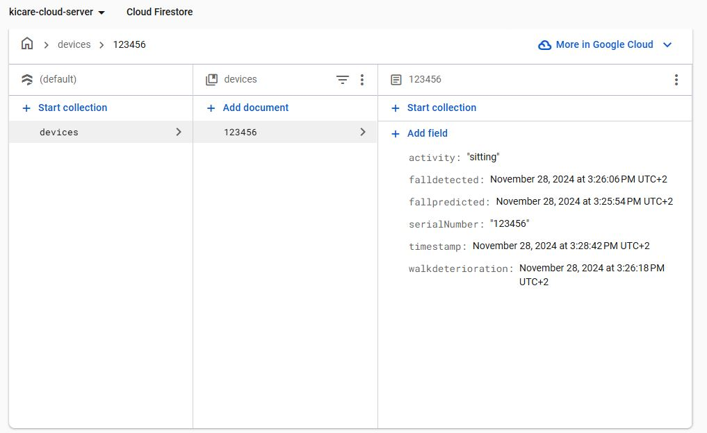
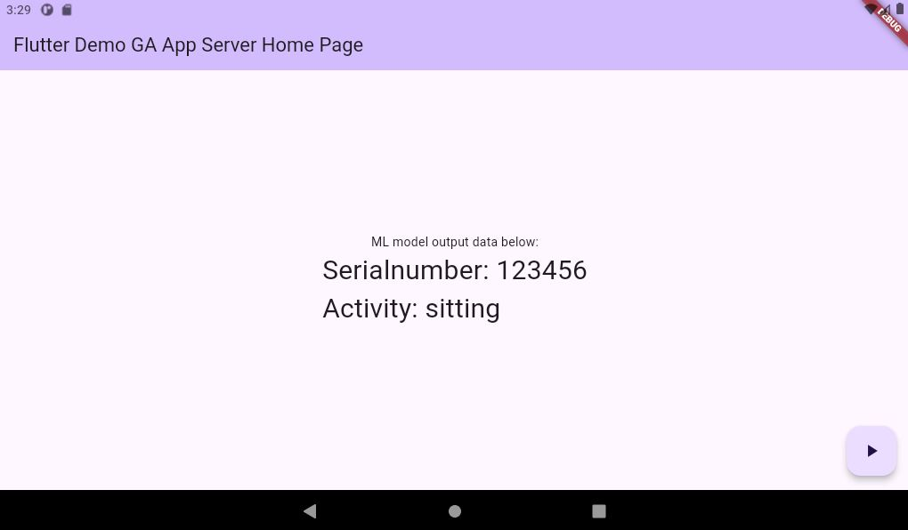

# kicare_ml_firebase_server1

A Flutter application for integrating machine learning, Firebase, and real-time sensor data.

## Overview

This application demonstrates the use of Firebase and Flutter to build an intelligent system that receives input data from an ESP8266 and a BMA400 sensor, processes it using a TensorFlow Lite model, and stores the output data in Firebase Firestore. The app also includes a user interface for monitoring and managing the data.

## Features

- **Firebase Integration**:
  - Authentication using Firebase.
  - Data storage and retrieval with Cloud Firestore.
- **TensorFlow Lite Integration**:
  - Model inference using `tflite_flutter`.
- **Real-Time Data Handling**:
  - Data input from ESP8266 and BMA400 sensor via WebSocket.
  - Storing processed output from the ML model in Firebase Firestore.
- **State Management**:
  - Leveraging `provider` for efficient state management.
  
## Used Packages

The project utilizes the following Flutter packages:
- **firebase_core:** For initializing Firebase in Flutter.
- **firebase_auth:** For user authentication.
- **cloud_firestore:** For storing and retrieving data in Firebase Firestore.
- **provider:** For state management.
- **web_socket_channel:** For handling WebSocket communication.
- **tflite_flutter:** For TensorFlow Lite model inference.

## Architecture

1. **Data Flow**:
   - Input data is sent from ESP8266 and BMA400 to the app via WebSocket.
   - The app processes the input data with a TensorFlow Lite model.
   - Output data is stored in Firebase Firestore.
   
2. **User Interface**:
   - The homepage provides an overview of the system and displays key data metrics.

## Screenshots

### Firestore Database Structure

Below is a screenshot of the Firestore database showing the stored model output data.

### App Homepage

Below is a screenshot of the application's homepage.

## Getting Started

### Prerequisites

- Flutter SDK installed on your machine.
- Firebase account and project set up.
- TensorFlow Lite model trained and deployed in the app.
- ESP8266 and BMA400 sensor for input data.

### Setup

1. Clone the repository:
    git clone https://github.com/your-repo/kicare_ml_firebase_server1.git
    cd kicare_ml_firebase_server1
2. Install dependencies:
    flutter pub get
3. Configure Firebase:
    - Download your google-services.json file (for Android) or GoogleService-Info.plist (for iOS) from the Firebase Console.
    - Place it in the respective platform directories (android/app or ios/Runner).
    - select android emulator from the command pallete/select device.
4. Run the application:
    flutter run

#### Documentation
For more information about the tools and packages used:

- Flutter Documentation
- Firebase Documentation
- tflite_flutter Documentation
- provider Documentation
- web_socket_channel Documentation

#### Contributions
Contributions to the project are welcome. Feel free to open issues or submit pull requests.

